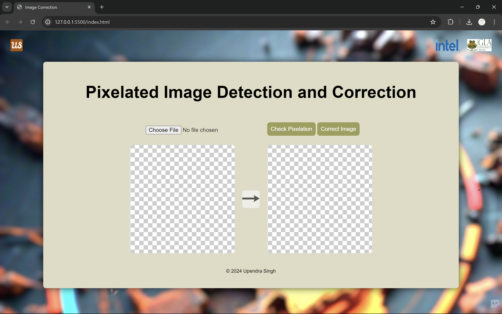

# Detect pixelated image and correct it

This project aims to detect and correct pixelated images using a deep learning model. The backend is implemented with Flask, and TensorFlow is used for loading the model and performing image processing.

Dataset used:




## Table of Contents

- [Overview](#overview)
- [Prerequisites](#prerequisites)
- [Installation](#installation)
- [Usage](#usage)
- [Project Structure](#project-structure)
- [Model Details](#model-details)
- [Optimizations](#optimizations)
- [Contributing](#contributing)
- [License](#license)
- [Contact](#contact)

## Overview

The Pixelation Correction AI Model detects and corrects pixelated images using a deep learning approach. The model is trained with TensorFlow and served using a Flask backend. The project also includes a web interface for uploading and processing images.

## Prerequisites

- Python 3.7+
- TensorFlow 2.x
- Flask
- Git

## Installation

1. **Clone the repository:**

    ```sh
    git clone https://github.com/upendrasingh-63/intel_project.git
    cd intel_project
    ```

2. **Create a virtual environment:**

    ```sh
    python -m venv venv
    source venv/bin/activate  # On Windows use `venv\Scripts\activate`
    ```

3. **Install the dependencies:**

    ```sh
    pip install -r requirements.txt
    ```

4. **Download the model:**

    Download the `pixelation_detection_model.tflite`,`pixelation_correction_model.tflite` file and place it in the `model` directory.

## Usage

1. **Run the Flask app:**

    ```sh
    python app.py
    ```

2. **Access the web interface:**

    Open your browser and go to `http://127.0.0.1:5000`.

3. **Upload an image:**

    Use the web interface to upload a pixelated image and get the corrected result.

## Project Structure


## Model Details

- **Model Architecture:**
  - The model uses a Convolutional Neural Network (CNN) to process and correct pixelated images.
  - It is trained on a dataset of pixelated images and their corrected counterparts.

- **Optimizations:**
  - Pruning and quantization techniques are used to reduce the model size.
  - The model is quantized to TensorFlow Lite for faster inference.

## Optimizations

1. **Model Pruning:**

    ```python
    import tensorflow as tf
    from tensorflow_model_optimization.sparsity import keras as sparsity

    model = tf.keras.models.load_model('model/pixelation_correction_model.h5')
    pruning_params = {
        'pruning_schedule': sparsity.PolynomialDecay(initial_sparsity=0.50, final_sparsity=0.90, begin_step=0, end_step=1000)
    }
    pruned_model = sparsity.prune_low_magnitude(model, **pruning_params)
    pruned_model.compile(optimizer='adam', loss='categorical_crossentropy', metrics=['accuracy'])
    pruned_model = sparsity.strip_pruning(pruned_model)
    pruned_model.save('model/pruned_pixelation_correction_model.h5')
    ```

2. **Model Quantization:**

    ```python
    converter = tf.lite.TFLiteConverter.from_keras_model(model)
    converter.optimizations = [tf.lite.Optimize.DEFAULT]
    quantized_tflite_model = converter.convert()
    with open('model/quantized_pixelation_correction_model.tflite', 'wb') as f:
        f.write(quantized_tflite_model)
    ```

## Contributing

Contributions are welcome! Please fork this repository and submit pull requests.

## License

This project is licensed under the MIT License - see the [LICENSE](LICENSE) file for details.

## Contact

Upendra Singh - [adshivam4040@gmail.com](mailto:adshivam4040@gmail.com)

GitHub Repository: [https://github.com/upendrasingh-63/intel_project](https://github.com/upendrasingh-63/intel_project)
